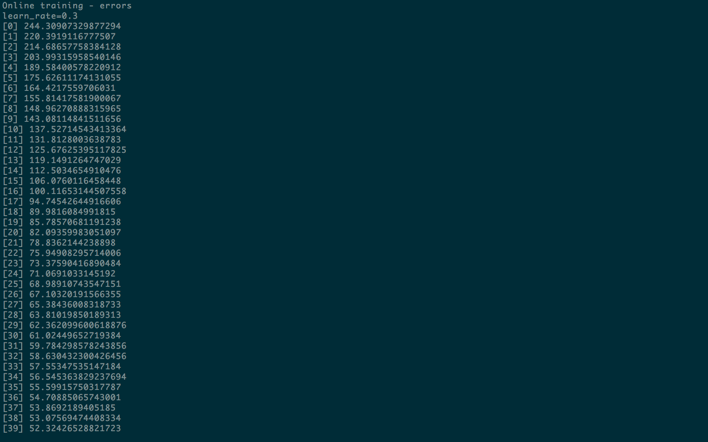
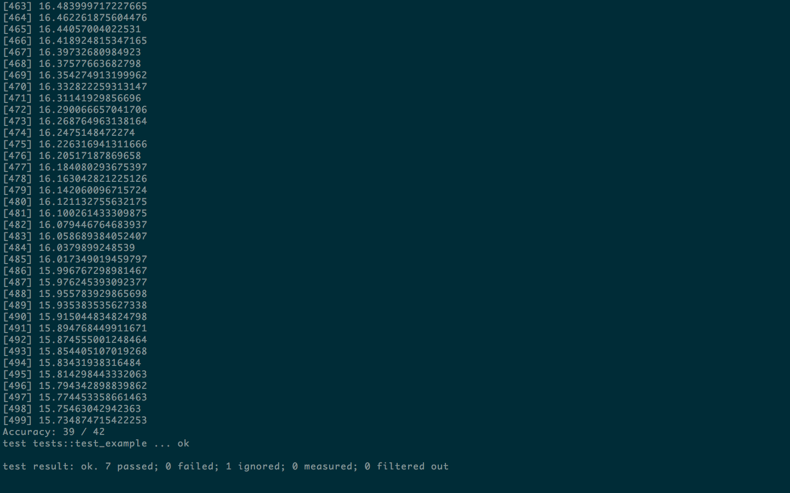

# nerv

Neural nets with:
* online learning
    * forward propagation of values
    * back propagation of errors
    * bias and weight updates for each neuron
    * repeat!
* variable number of hidden layers
* different numbers of neurons per hidden layer
* choice of transfer function
    * sigmoid
    * hyperbolic tangent (tanh)
    * rectifier
    * leaky rectifier

### Example
The following example is adapted from this [tutorial](https://machinelearningmastery.com/implement-backpropagation-algorithm-scratch-python/), which uses the [wheat seeds dataset](http://archive.ics.uci.edu/ml/datasets/seeds) from the UCI Machine Learning repository.

#### Code
```rust
extern crate csv;
extern crate nerv;
extern crate rand;

use csv::Reader;
use nerv::NNet;
use rand::{Rng,thread_rng};
use std::f64::INFINITY;

const NUM_INPUTS : usize = 7;
const NUM_OUTPUTS : usize = 3;

fn main() {

    let epochs = 500;
    let learn_rate = 0.3;
    let num_folds = 5;
    let layers = &[NUM_INPUTS, 5, NUM_OUTPUTS];

    // Create a new nnet
    let mut rng = thread_rng();
    let mut nnet = NNet::new(layers, "sigmoid", &mut rng).unwrap();

    // Read csv into Vec<Vec<f64>>
    let mut r = Reader::from_path("seeds.csv").unwrap();
    let mut data = r.deserialize::<Vec<f64>>().map(|rec| rec.unwrap()).collect::<Vec<_>>();

    // Normalize inputs
    normalize_inputs(data.as_mut_slice());

    // Shuffle data, split into train and test set
    rng.shuffle(&mut data);
    let rows_per_fold = data.len() / num_folds;
    let (test_data, train_data) = data.split_at_mut(rows_per_fold);

    // Train
    nnet.train_online(train_data, epochs, learn_rate).unwrap();

    // Predict and check results
    check_accuracy(&mut nnet, test_data);
}

fn normalize_inputs(data: &mut[Vec<f64>]) {
    let mut min;
    let mut max;
    for i in 0..NUM_INPUTS {
        min = INFINITY;
        max = -INFINITY;
        for row in data.iter() {
            if row[i] > max {
                max = row[i];
            } else if row[i] < min {
                min = row[i]
            }
        }
        let diff = max - min;
        for row in data.iter_mut() {
            row[i] = (row[i] - min) / diff;
        }
    }
}

fn check_accuracy(nnet: &mut NNet, data: &mut [Vec<f64>]) {
    let mut num_correct = 0;
    for row in data.iter_mut() {
        let (inputs, outputs) = row.split_at_mut(NUM_INPUTS);
        let predicts = nnet.predict(inputs).unwrap();
        let i = predicts.iter().enumerate().max_by(|&(_,v1), &(_,v2)| {
            v1.partial_cmp(&v2).unwrap()
        }).unwrap().0;
        if outputs[i] == 1.0 {
            num_correct += 1;
        }
    }
    println!("Accuracy: {} / {}", num_correct, data.len());
}
```

## Tests
`cargo test -- --nocapture` should run the example and other tests.

You should see the fraction of test data predicted correctly in the example.

### Sample output

